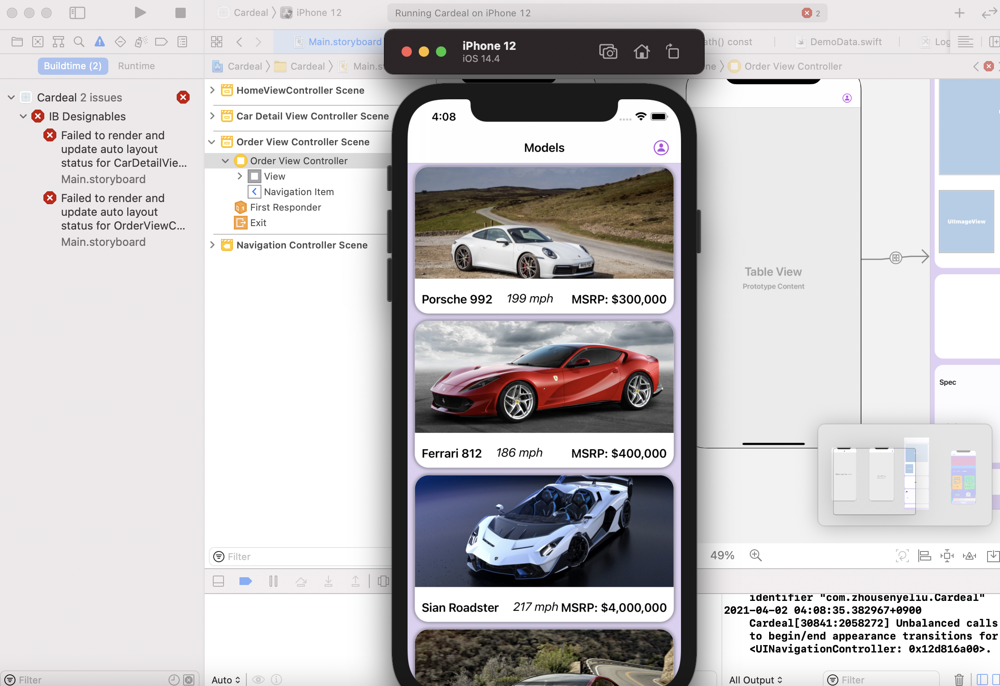

# Cardeal
Side project Cardeal. Pretty big one. An showcase + deposit order app offered for supercar dealers .   Still under development. 

## Screenshots
<h7 align="left">

</h7>

## Getting Started
Just opening Cardeal.xcworkspace with your xcode should fine, but remember to wait for importing external library and use iphone 12 as emulator.

## Compatibility
This project is written in Swift 5. The newest version  of kinfisher needs Xcode 12 to import, so it requires Xcode 12 or newer to build and run.( using xcode 11 will cause compile error )

## Development plan & TODOs
Basic UI(done) -> Firebase Setting(done) ->  stripe API (done)-> administration web app (currently working on)-> transaction API use 

## IMPORTANT NOTICEs
1. If your mac is M1, you will see these IB Designables errors .

<h3 align="center">

</h3>

Well,  this is Xcode bug caused by chip architecture. It does look ugly , but it does not affect compiling

2. It's  possible to see some autolayout warnings . It runs without those warnings on my mac, but it could happen on your environment . (I dont know why , possibly because autolayout is crappy.)

3. The version control part of xcode with github  acts very weired. I will often do some "test" commits to  this repo to make sure my version control still works . Sorry about that.

## Author

* Zhousenye Liu

